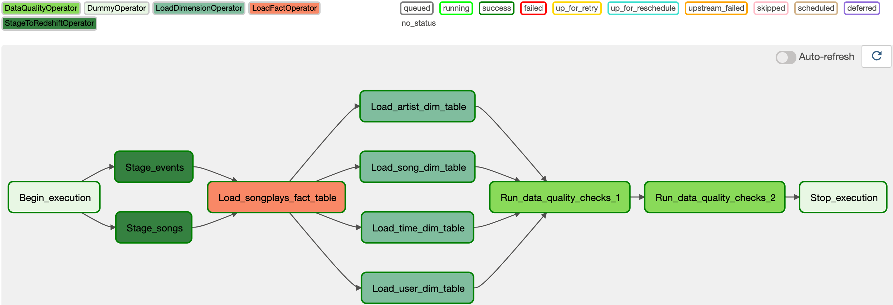

# Airflow Data Pipeline

## Summary

This project consists in orchestrating an ETL pipeline using Apache Airflow for:

1. Copying the below two datasets from S3 into staging tables in a Redshift data warehouse:
   * song data from a subset of the [Million Song Dataset](https://labrosa.ee.columbia.edu/millionsong/)
   * user activity logs from a music streaming app.
2. In the same Redshift data warehouse, combining these staging tables for analytics purposes using the following star schema.

3. Performing data quality checks to ensure the pipeline is working as expected.

## Detailed schema


##### Fact Table

1. songplays
   * records in log data associated with song plays i.e. records with page `NextSong`
     * *songplay_id, start_time, user_id, level, song_id, artist_id, session_id, location, user_agent*

##### Dimension Tables

1. times
   - timestamps of records in **songplays** broken down into specific units
     - *start_time, hour, day, week, month, year, weekday*
2. users
   * users in the app
     * *user_id, first_name, last_name, gender, level*
3. songs
   * songs in music database
     * *song_id, title, artist_id, year, duration*
4. artists
   * artists in music database
     * *artist_id, name, location, latitude, longitude*

## Pipeline



## Files description

1. `requirements.txt` lists all packages used in the scripts of this repository. This project uses **Airflow 2**.

2. `create-aws-resources.ipynb` creates (and deletes) the required resources on AWS (EC2 security group and Redshift cluster) for running the scripts below. Since the data warehouse is created only for learning purposes, we want to keep the cluster running only while we are working on it and delete it when we are done in order not to incur unnecessary costs. 

3. `create_tables.sql` creates the relevant tables in the data warehouse.

4. `airflow/` is where the Airflow orchestration takes place:

   * `dags/sparkify_dag.py` is where the DAG is defined

   * `plugins/` contains objects required by the DAG
     * `operators/` contains the custom operators used by the DAG
     * `helpers/sql_queries.py` contains several queries used by the DAG.

5. `test.ipynb` is for the ease of testing during the development.

## How to run this project

1. Make sure you have a configuration file `dwh.config` ready with your AWS credentials and the desired configuration of your cluster. Mine looks like the below:

   ```
   [AWS]
   key = paste_your_key_here
   secret = paste_your_secret_key_here
   
   [DWH]
   dwh_cluster_type = multi-node
   dwh_num_nodes = 4
   dwh_node_type = dc2.large
   dwh_cluster_identifier = dwhcluster
   host = to_be_filled_after_cluster_is_created
   dwh_db_name = dwh
   dwh_db_user = dwhuser
   dwh_db_password = pick_a_password_here
   dwh_port = 5439
   
   [EC2]
   dwh_sec_group_name = redshift-sg
   ```

* From this repository, and using Python 3.8 with at least `pip` and `virtualenv` installed, create a new virtual environment and activate it:

  ```bash
  virtualenv -p python venv
  source venv/bin/activate
  ```

* Install the packages listed in `requirements.txt`:

  ```bash
  pip install -r requirements.txt
  ```

* Initialise Airflow:

  ```bash
  cd airflow
  export AIRFLOW_HOME=/path/to/folder/airflow
  airflow db init
  ```

* Create a new user

  ```bash
  airflow users create \
        --role Admin \
        --username admin \
        --email admin \
        --firstname admin \
        --lastname admin \
        --password admin
  ```

* If not already the case, make sure the folders `dags` and `plugins` are inside the `airflow` folder.

* Start the Airflow scheduler:

  ```bash
  airflow scheduler
  ```

* Start a new terminal (reactivate `venv` and re-export `AIRFLOW_HOME`) to start the web server and login as the new user you just created:

  ```bash
  source venv/bin/activate
  export AIRFLOW_HOME=/path/to/folder/airflow
  airflow webserver
  ```

* Create the required AWS ressources by running `create-aws-resources.ipynb`.

* In the Airflow UI, configure:
  * An AWS **connection** named `aws_credentials`
  * A Postgres **connection** named `redshift` pointing to the Redshift instance just created
  * A **variable** `s3_bucket` with value `udacity-dend`
  * A **variable** `s3_song_data` with value `song_data`
  * A **variable** `s3_log_data` with value `log_data`
  * A **variable** `s3_log_data_path` with value `log_json_path.json`.
* Create the required tables in your Redshift instance by running the queries in `create_tables.sql` (e.g. from the query editor in the Redshift console).
* Toggle on the DAG to trigger the pipeline.